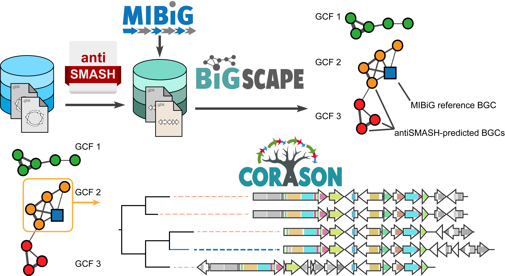

<table align="center">
	<tr>
      <td>   </td>
   </tr>
<tr align="center" >
	<table>
		<tr>
   <td style="vertical-align: middle" align="center" width="300px">
    <a href="https://git.wageningenur.nl/medema-group/BiG-SCAPE/wikis/home"> BiG-SCAPE wiki</a>
   </td>
   
   <td  style="vertical-align: middle" align="center" width="300px">
    <a href="https://github.com/nselem/corason/wiki"> Corason wiki</a>
   </td>
   
   </tr>
   </table>
   </tr>
</table>

   
<b> BiG-SCAPE/CORASON pipeline  </b> 
BiG-SCAPE and CORASON provide a set of tools to explore the diversity of biosynthetic gene clusters (BGCs) across large numbers of genomes, b
y constructing BGC sequence similarity networks, grouping BGCs into gene cluster families, and exploring gene cluster diversity linked to enz
yme phylogenies.     

Please consult our [bigscape-corason website](https://bigscape-corason.secondarymetabolites.org/). To get a more
 detailed explanation about parameters in BiG-SCAPE or CORASON please consult their wiki sites.    

Please use the issues of this repository to communicate with us !
The mantained repository for BiG-SCAPE is located at gitlab -> [BiG-SCAPE gitlab](https://git.wageningenur.nl/medema-group/BiG-SCAPE/-/tree/master)

</body>

</html>
