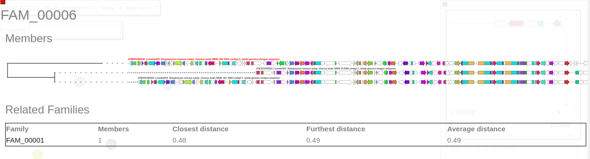

# BiG-SCAPE / CORASON tutorial  
This tutorial explains how to download datasets to run BiG-SCAPE and CORASON, and provides examples for how to use both tools.  
  
## Download example dataset  
### Example dataset  
In a clean directory donwload and execute the following script to obtain the directories gbk and genomes and the fasta file TauD.fasta. If you already download the data from CORASON example this step can be omitted.   
`$ mkdir ~/bin    # not required if you already have that`  
`$ curl https://raw.githubusercontent.com/nselem/bigscape-corason/master/scripts/data_bigscape_corason.sh>~/bin/data_bigscape_corason.sh`    
`$ chmod a+x ~/bin/data_bigscape_corason.sh`    
`$ data_bigscape_corason.sh`    

Data can also be downloaded manually at: 
  

### How to compile your own input dataset  
In this tutorial, we will work with the above example data. If you want to use your own gene clusters as input for BiG-SCAPE and the CORASON family mode integrated within the BiG-SCAPE pipeline, you can search for publicly available genomes in antiSMASH-DB and download the desired cluster files in GBK format. Alternatively, you can perform your own antiSMASH runs on the public web server or on your local system, collect the cluster GBK files and put them together in a folder that you can use as input for BiG-SCAPE..Entries from MIBiG can be added automatically by adding the --mibig flag to the end of your BiG-SCAPE command (see below).  

## BiG-SCAPE example  
We will now proceed with the example data. Once data have been downloaded run the following command at the terminal:  

`$ run_bigscape gbks bigscape_salida`  
 If bigscape is properly running the terminal will show something similar to:  
 
 
The _input_ file for BiG-SCAPE is the directory _gbks_ that contains genbank files of sequences of Biosynthetical gene clusters (BGCs) predicted by antiSMASH. The BiG-SCAPE _output_  will be stored in the directory big_scape_salida.    

After BiG-SCAPE has finished successfully open the index.html file located inside the folder bigscape_salida with your browser, e.g. Chrome or Firefox. The file contains an interactive offline webpage that displays the BiG-SCAPE results and allows you to interactively explore them.  
  

To start exploring, select a class at the top of the site:  
  
 
Now, the screen will display a network visualization of BGC families within this class.  
  

In this case, the NRPS class contains 10 BGCs organized in one gene cluster family of three members, one family of two members and five singletons.  

Now select a family in this network to visualize BGCs sorted and aligned by CORASON.  
  
 This family contains three members.  

BiG-SCAPE output is also compatible with Cytoscape visualization.  

In another example BiG-SCAPE was employed to calculate BGC familiess in 103 complete Streptomyces genomes. The outcome of this run can be found [here](http://bioinformatics.nl/~xnava009/streptomyces_out/)  

## CORASON example 

## Corason example  
`run_corason -g gbks -q TauD.faa -s BGC0000715.1.cluster001.gbk`    
